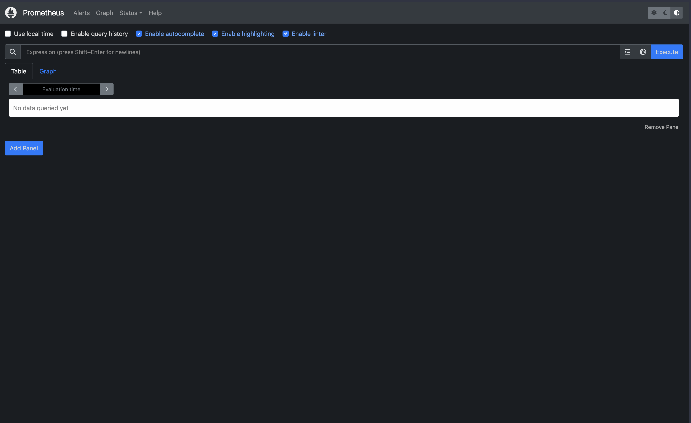
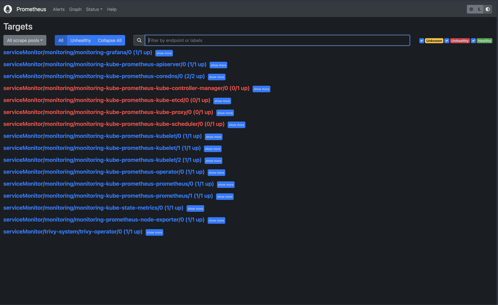
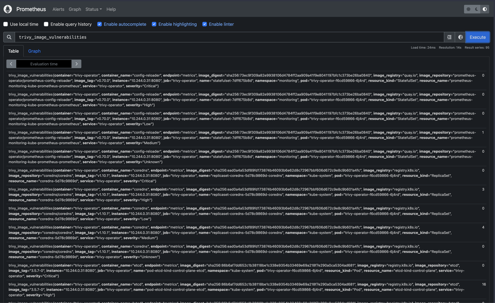
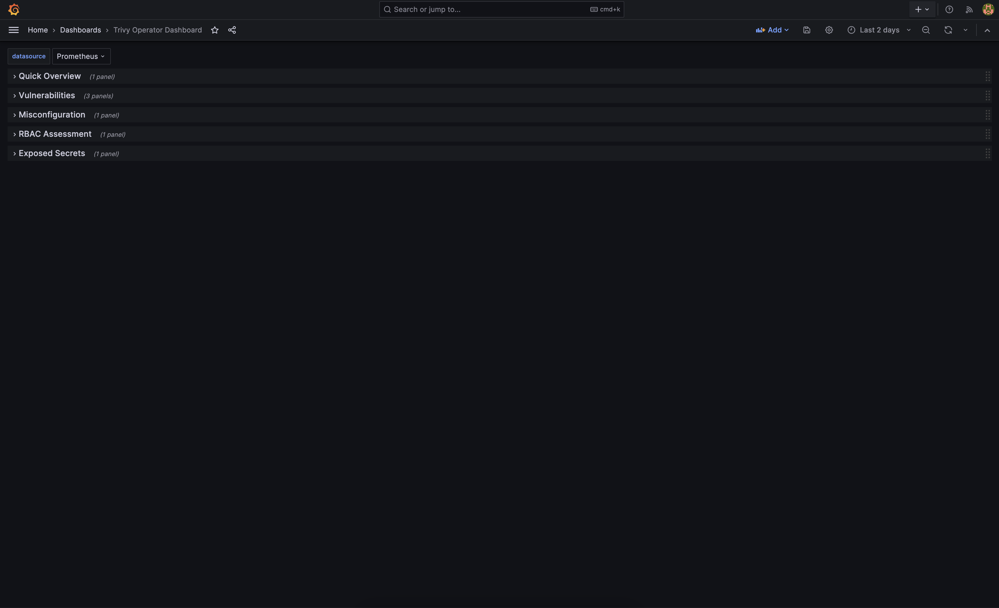
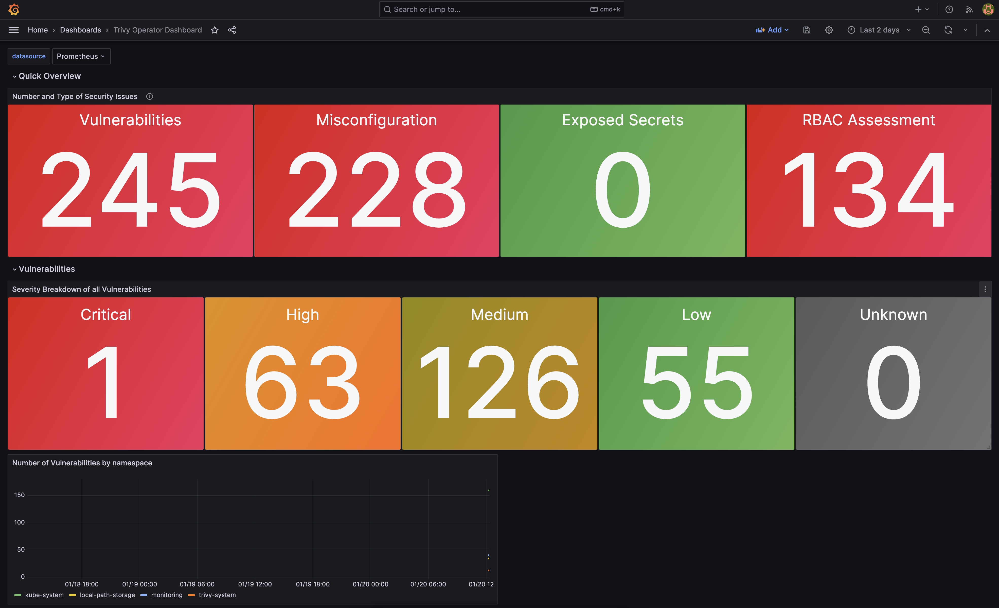

# **How to scan your container images and Kubernetes clusters with Trivy**

Hey there👋,

In this article, I'm excited to show you how to scan your container images with Trivy. First, we'll explore why scanning your images is crucial, and then we'll dive into Trivy and how to scan both container images and Kubernetes clusters. For those running applications in Kubernetes, we'll also cover scanning images at runtime and visualizing vulnerabilities in Grafana. You can find the code snippets I'll use [right here on GitHub](https://github.com/m-over/talk-and-blog-resources).

Let's jump right into container scanning…

### **Why should I scan my Container images?**

Container scanning is all about analyzing your container to identify vulnerabilities. The primary goal is to find these vulnerabilities and potential security risks before deploying your container. You'll be scanning container images for security threats such as:

**Vulnerabilities in OS Packages**: Scanners evaluate operating system packages within the container for known vulnerabilities. This includes checking system libraries, binaries, and other components against databases of known security vulnerabilities.

**Application Dependencies**: Scanning also includes reviewing application dependencies, such as libraries and frameworks, for security issues. This process covers both direct and transitive dependencies and involves checking against databases of known vulnerabilities.

**Misconfigurations**: Scanners identify potential misconfigurations in container settings that could lead to security risks. This includes issues with network configurations, file permissions, and environment settings. The scanning process helps ensure compliance with best practices and security standards.

**Secrets and Sensitive Data**: Some scanners can detect embedded secrets, such as passwords or API keys, in container images. This step is crucial to prevent security breaches due to exposed sensitive information.

Scanning container images is a preventative step to address security concerns. It involves early identification and resolution of vulnerabilities.

### **When should I scan my containers?**

The main goal of scanning containers is to minimize security risks. It's important to scan your containers at two critical times: first, during the development process each time you build a container, and second, in the environment where the container is actually running. It might seem like you have to choose between these two, but in reality, you need to do both.

Imagine you're a developer with a CI/CD pipeline that includes scanning containers. Your app encounters a critical vulnerability, and you need to fix it immediately. You might start by fixing the code or updating dependencies, which is a good first step. After you made the changes and built a new container, and your pipeline completes successfully, it's crucial to check that the security issue is fixed at every stage, both in development and in production. You can achieve this task by checking all running containers in each environment. But for me, this is an annoying task. That's where installing a container scanner in your runtime environment, like a Kubernetes cluster, becomes valuable. In this case, we can use the trivia-operator to run the scanner directly in the cluster.

Now, let's explore Trivy in more detail and see how you can use it.

### **What is Trivy and how can I use it?**

Trivy is an open-source tool for scanning containers, Infrastructure as Code, VM Images, filesystems, and more for security vulnerabilities or misconfigurations. You can find more information about Trivy [here](https://github.com/aquasecurity/trivy).

While there are other tools out there, Trivy is my go-to because of its versatility. I use it for scanning containers in a CI system, locally on my machine, and even complete Kubernetes clusters for security risks. Trivy can also scan your Git repo for leaked secrets and Infrastructure as Code for misconfigurations.

To use Trivy, first, install it on your machine by following the installation documentation [here](https://aquasecurity.github.io/trivy/v0.18.3/installation/).

Here's how to check your Trivy version:

```bash
trivy version
```

```bash
$ trivy version
Version: 0.48.3
Vulnerability DB:
  Version: 2
  UpdatedAt: 2024-01-19 12:13:36.098203179 +0000 UTC
  NextUpdate: 2024-01-19 18:13:36.098202938 +0000 UTC
  DownloadedAt: 2024-01-19 13:40:41.442557 +0000 UTC
```

This command not only shows the Trivy version but also information about the last update of the Vulnerability Database. Now, let's scan an image. We'll use the alpine:3.17.4 image, which is older and likely has some security risks. To scan the image, run:

```bash
trivy image alpine:3.17.4
```

```yaml
$ trivy image alpine:3.17.4
2024-01-19T14:46:43.705+0100	INFO	Vulnerability scanning is enabled
2024-01-19T14:46:43.705+0100	INFO	Secret scanning is enabled
2024-01-19T14:46:43.705+0100	INFO	If your scanning is slow, please try '--scanners vuln' to disable secret scanning
2024-01-19T14:46:43.705+0100	INFO	Please see also https://aquasecurity.github.io/trivy/v0.48/docs/scanner/secret/#recommendation for faster secret detection
2024-01-19T14:46:46.004+0100	INFO	Detected OS: alpine
2024-01-19T14:46:46.004+0100	INFO	Detecting Alpine vulnerabilities...
2024-01-19T14:46:46.006+0100	INFO	Number of language-specific files: 0

alpine:3.17.4 (alpine 3.17.4)

Total: 14 (UNKNOWN: 0, LOW: 0, MEDIUM: 12, HIGH: 2, CRITICAL: 0)

┌────────────┬───────────────┬──────────┬────────┬───────────────────┬───────────────┬─────────────────────────────────────────────────────────────┐
│  Library   │ Vulnerability │ Severity │ Status │ Installed Version │ Fixed Version │                            Title                            │
├────────────┼───────────────┼──────────┼────────┼───────────────────┼───────────────┼─────────────────────────────────────────────────────────────┤
│ libcrypto3 │ CVE-2023-5363 │ HIGH     │ fixed  │ 3.0.9-r1          │ 3.0.12-r0     │ openssl: Incorrect cipher key and IV length processing      │
│            │               │          │        │                   │               │ https://avd.aquasec.com/nvd/cve-2023-5363                   │
│            ├───────────────┼──────────┤        │                   ├───────────────┼─────────────────────────────────────────────────────────────┤
│            │ CVE-2023-2975 │ MEDIUM   │        │                   │ 3.0.9-r2      │ openssl: AES-SIV cipher implementation contains a bug that  │
│            │               │          │        │                   │               │ causes it to ignore...                                      │
│            │               │          │        │                   │               │ https://avd.aquasec.com/nvd/cve-2023-2975                   │
│            ├───────────────┤          │        │                   ├───────────────┼─────────────────────────────────────────────────────────────┤
│            │ CVE-2023-3446 │          │        │                   │ 3.0.9-r3      │ openssl: Excessive time spent checking DH keys and          │
│            │               │          │        │                   │               │ parameters                                                  │
│            │               │          │        │                   │               │ https://avd.aquasec.com/nvd/cve-2023-3446                   │
│            ├───────────────┤          │        │                   ├───────────────┼─────────────────────────────────────────────────────────────┤
│            │ CVE-2023-3817 │          │        │                   │ 3.0.10-r0     │ OpenSSL: Excessive time spent checking DH q parameter value │
│            │               │          │        │                   │               │ https://avd.aquasec.com/nvd/cve-2023-3817                   │
│            ├───────────────┤          │        │                   ├───────────────┼─────────────────────────────────────────────────────────────┤
│            │ CVE-2023-5678 │          │        │                   │ 3.0.12-r1     │ openssl: Generating excessively long X9.42 DH keys or       │
│            │               │          │        │                   │               │ checking excessively long X9.42...                          │
│            │               │          │        │                   │               │ https://avd.aquasec.com/nvd/cve-2023-5678                   │
│            ├───────────────┤          │        │                   ├───────────────┼─────────────────────────────────────────────────────────────┤
│            │ CVE-2023-6129 │          │        │                   │ 3.0.12-r2     │ openssl: POLY1305 MAC implementation corrupts vector        │
│            │               │          │        │                   │               │ registers on PowerPC                                        │
│            │               │          │        │                   │               │ https://avd.aquasec.com/nvd/cve-2023-6129                   │
│            ├───────────────┤          │        │                   ├───────────────┼─────────────────────────────────────────────────────────────┤
│            │ CVE-2023-6237 │          │        │                   │ 3.0.12-r3     │ openssl: Excessive time spent checking invalid RSA public   │
│            │               │          │        │                   │               │ keys                                                        │
│            │               │          │        │                   │               │ https://avd.aquasec.com/nvd/cve-2023-6237                   │
├────────────┼───────────────┼──────────┤        │                   ├───────────────┼─────────────────────────────────────────────────────────────┤
│ libssl3    │ CVE-2023-5363 │ HIGH     │        │                   │ 3.0.12-r0     │ openssl: Incorrect cipher key and IV length processing      │
│            │               │          │        │                   │               │ https://avd.aquasec.com/nvd/cve-2023-5363                   │
│            ├───────────────┼──────────┤        │                   ├───────────────┼─────────────────────────────────────────────────────────────┤
│            │ CVE-2023-2975 │ MEDIUM   │        │                   │ 3.0.9-r2      │ openssl: AES-SIV cipher implementation contains a bug that  │
│            │               │          │        │                   │               │ causes it to ignore...                                      │
│            │               │          │        │                   │               │ https://avd.aquasec.com/nvd/cve-2023-2975                   │
│            ├───────────────┤          │        │                   ├───────────────┼─────────────────────────────────────────────────────────────┤
│            │ CVE-2023-3446 │          │        │                   │ 3.0.9-r3      │ openssl: Excessive time spent checking DH keys and          │
│            │               │          │        │                   │               │ parameters                                                  │
│            │               │          │        │                   │               │ https://avd.aquasec.com/nvd/cve-2023-3446                   │
│            ├───────────────┤          │        │                   ├───────────────┼─────────────────────────────────────────────────────────────┤
│            │ CVE-2023-3817 │          │        │                   │ 3.0.10-r0     │ OpenSSL: Excessive time spent checking DH q parameter value │
│            │               │          │        │                   │               │ https://avd.aquasec.com/nvd/cve-2023-3817                   │
│            ├───────────────┤          │        │                   ├───────────────┼─────────────────────────────────────────────────────────────┤
│            │ CVE-2023-5678 │          │        │                   │ 3.0.12-r1     │ openssl: Generating excessively long X9.42 DH keys or       │
│            │               │          │        │                   │               │ checking excessively long X9.42...                          │
│            │               │          │        │                   │               │ https://avd.aquasec.com/nvd/cve-2023-5678                   │
│            ├───────────────┤          │        │                   ├───────────────┼─────────────────────────────────────────────────────────────┤
│            │ CVE-2023-6129 │          │        │                   │ 3.0.12-r2     │ openssl: POLY1305 MAC implementation corrupts vector        │
│            │               │          │        │                   │               │ registers on PowerPC                                        │
│            │               │          │        │                   │               │ https://avd.aquasec.com/nvd/cve-2023-6129                   │
│            ├───────────────┤          │        │                   ├───────────────┼─────────────────────────────────────────────────────────────┤
│            │ CVE-2023-6237 │          │        │                   │ 3.0.12-r3     │ openssl: Excessive time spent checking invalid RSA public   │
│            │               │          │        │                   │               │ keys                                                        │
│            │               │          │        │                   │               │ https://avd.aquasec.com/nvd/cve-2023-6237                   │
└────────────┴───────────────┴──────────┴────────┴───────────────────┴───────────────┴─────────────────────────────────────────────────────────────┘
```

The scan results show the libraries with vulnerabilities, the vulnerability number, and severity. You'll also see the status of whether a fix is available, the installed version, and the version with the fix. In our case, we can update the base image to a newer version, such as alpine:3.19.0 to fix some vulnerabilities. Let's scan this updated image, and check if there is a fix:

```bash
trivy image alpine:3.19.0
```

```yaml
$ trivy image alpine:3.19.0
2024-01-19T14:56:48.922+0100	INFO	Vulnerability scanning is enabled
2024-01-19T14:56:48.922+0100	INFO	Secret scanning is enabled
2024-01-19T14:56:48.922+0100	INFO	If your scanning is slow, please try '--scanners vuln' to disable secret scanning
2024-01-19T14:56:48.922+0100	INFO	Please see also https://aquasecurity.github.io/trivy/v0.48/docs/scanner/secret/#recommendation for faster secret detection
2024-01-19T14:56:51.432+0100	INFO	Detected OS: alpine
2024-01-19T14:56:51.432+0100	WARN	This OS version is not on the EOL list: alpine 3.19
2024-01-19T14:56:51.432+0100	INFO	Detecting Alpine vulnerabilities...
2024-01-19T14:56:51.435+0100	INFO	Number of language-specific files: 0

alpine:3.19.0 (alpine 3.19.0)

Total: 4 (UNKNOWN: 0, LOW: 0, MEDIUM: 4, HIGH: 0, CRITICAL: 0)

┌────────────┬───────────────┬──────────┬────────┬───────────────────┬───────────────┬───────────────────────────────────────────────────────────┐
│  Library   │ Vulnerability │ Severity │ Status │ Installed Version │ Fixed Version │                           Title                           │
├────────────┼───────────────┼──────────┼────────┼───────────────────┼───────────────┼───────────────────────────────────────────────────────────┤
│ libcrypto3 │ CVE-2023-6129 │ MEDIUM   │ fixed  │ 3.1.4-r2          │ 3.1.4-r3      │ openssl: POLY1305 MAC implementation corrupts vector      │
│            │               │          │        │                   │               │ registers on PowerPC                                      │
│            │               │          │        │                   │               │ https://avd.aquasec.com/nvd/cve-2023-6129                 │
│            ├───────────────┤          │        │                   ├───────────────┼───────────────────────────────────────────────────────────┤
│            │ CVE-2023-6237 │          │        │                   │ 3.1.4-r4      │ openssl: Excessive time spent checking invalid RSA public │
│            │               │          │        │                   │               │ keys                                                      │
│            │               │          │        │                   │               │ https://avd.aquasec.com/nvd/cve-2023-6237                 │
├────────────┼───────────────┤          │        │                   ├───────────────┼───────────────────────────────────────────────────────────┤
│ libssl3    │ CVE-2023-6129 │          │        │                   │ 3.1.4-r3      │ openssl: POLY1305 MAC implementation corrupts vector      │
│            │               │          │        │                   │               │ registers on PowerPC                                      │
│            │               │          │        │                   │               │ https://avd.aquasec.com/nvd/cve-2023-6129                 │
│            ├───────────────┤          │        │                   ├───────────────┼───────────────────────────────────────────────────────────┤
│            │ CVE-2023-6237 │          │        │                   │ 3.1.4-r4      │ openssl: Excessive time spent checking invalid RSA public │
│            │               │          │        │                   │               │ keys                                                      │
│            │               │          │        │                   │               │ https://avd.aquasec.com/nvd/cve-2023-6237                 │
└────────────┴───────────────┴──────────┴────────┴───────────────────┴───────────────┴───────────────────────────────────────────────────────────┘
```

You'll notice fewer vulnerabilities in the newer image. To fix the remaining issues, you can build your image with patches for libcrypto3 and libssl3 or contribute to the base image to address the vulnerability.

Now, let's explore how to check the security status of a Kubernetes cluster. We can scan all images running inside a Kubernetes cluster. To demonstrate, I'll create a local kind cluster (you can learn how to do that [here](https://medium.com/@m0v_3r/intro-to-kind-7d553ed40ce0)). For scanning the cluster, run:

```bash
trivy k8s --report summary cluster
```

```yaml
$ trivy k8s --report summary cluster
44.93 KiB / 44.93 KiB [-----------------------------------------------------------------------------------------------------] 100.00% ? p/s 200ms
205 / 205 [-----------------------------------------------------------------------------------------------------------------------] 100.00% 5 p/s

Summary Report for kind-kind

Workload Assessment
┌────────────────────┬────────────────────────────────────────────────┬─────────────────────┬───────────────────┬───────────────────┐
│     Namespace      │                    Resource                    │   Vulnerabilities   │ Misconfigurations │      Secrets      │
│                    │                                                ├───┬───┬────┬────┬───┼───┬───┬───┬───┬───┼───┬───┬───┬───┬───┤
│                    │                                                │ C │ H │ M  │ L  │ U │ C │ H │ M │ L │ U │ C │ H │ M │ L │ U │
├────────────────────┼────────────────────────────────────────────────┼───┼───┼────┼────┼───┼───┼───┼───┼───┼───┼───┼───┼───┼───┼───┤
│ local-path-storage │ Deployment/local-path-provisioner              │   │ 5 │ 18 │ 11 │   │   │ 1 │ 3 │ 9 │   │   │   │   │   │   │
│ kube-system        │ Pod/kube-controller-manager-kind-control-plane │   │   │    │    │   │   │ 2 │ 4 │ 7 │   │   │   │   │   │   │
│ kube-system        │ DaemonSet/kindnet                              │   │ 5 │ 16 │ 22 │   │   │ 3 │ 5 │ 5 │   │   │   │   │   │   │
│ kube-system        │ DaemonSet/kube-proxy                           │   │ 8 │ 19 │ 22 │   │   │ 3 │ 4 │ 9 │   │   │   │   │   │   │
│ kube-system        │ Deployment/coredns                             │   │ 3 │ 4  │    │   │   │ 1 │ 3 │ 4 │   │   │   │   │   │   │
│ kube-system        │ ConfigMap/extension-apiserver-authentication   │   │   │    │    │   │   │   │ 1 │   │   │   │   │   │   │   │
│ kube-system        │ Pod/kube-apiserver-kind-control-plane          │   │   │    │    │   │   │ 2 │ 4 │ 8 │   │   │   │   │   │   │
│ kube-system        │ Pod/etcd-kind-control-plane                    │   │   │    │    │   │   │ 2 │ 4 │ 6 │   │   │   │   │   │   │
│ kube-system        │ Pod/kube-scheduler-kind-control-plane          │   │   │    │    │   │   │ 2 │ 4 │ 7 │   │   │   │   │   │   │
│                    │ NodeComponents/kind-control-plane              │   │ 2 │ 1  │    │   │   │   │   │   │   │   │   │   │   │   │
└────────────────────┴────────────────────────────────────────────────┴───┴───┴────┴────┴───┴───┴───┴───┴───┴───┴───┴───┴───┴───┴───┘
Severities: C=CRITICAL H=HIGH M=MEDIUM L=LOW U=UNKNOWN

RBAC Assessment
┌─────────────┬─────────────────────────────────────────────────────────────────┬───────────────────┐
│  Namespace  │                            Resource                             │  RBAC Assessment  │
│             │                                                                 ├───┬───┬───┬───┬───┤
│             │                                                                 │ C │ H │ M │ L │ U │
├─────────────┼─────────────────────────────────────────────────────────────────┼───┼───┼───┼───┼───┤
│ kube-system │ Role/system:controller:token-cleaner                            │   │   │ 1 │   │   │
│ kube-system │ Role/system:controller:cloud-provider                           │   │   │ 1 │   │   │
│ kube-system │ Role/system::leader-locking-kube-scheduler                      │   │   │ 1 │   │   │
│ kube-system │ Role/system:controller:bootstrap-signer                         │   │   │ 1 │   │   │
│ kube-system │ Role/system::leader-locking-kube-controller-manager             │   │   │ 1 │   │   │
│ kube-public │ RoleBinding/kubeadm:bootstrap-signer-clusterinfo                │ 1 │   │   │   │   │
│ kube-public │ Role/system:controller:bootstrap-signer                         │   │   │ 1 │   │   │
│             │ ClusterRole/system:controller:persistent-volume-binder          │ 1 │ 2 │ 1 │   │   │
│             │ ClusterRole/cluster-admin                                       │ 2 │   │   │   │   │
│             │ ClusterRole/system:controller:daemon-set-controller             │   │   │ 1 │   │   │
│             │ ClusterRole/system:kube-controller-manager                      │ 5 │ 2 │   │   │   │
│             │ ClusterRole/system:controller:endpointslicemirroring-controller │   │ 1 │   │   │   │
│             │ ClusterRole/local-path-provisioner-role                         │ 1 │ 1 │ 1 │   │   │
│             │ ClusterRole/system:controller:statefulset-controller            │   │   │ 1 │   │   │
│             │ ClusterRole/system:controller:endpointslice-controller          │   │ 1 │   │   │   │
│             │ ClusterRole/system:aggregate-to-edit                            │ 2 │ 4 │ 6 │   │   │
│             │ ClusterRole/system:controller:cronjob-controller                │   │   │ 3 │   │   │
│             │ ClusterRole/system:controller:deployment-controller             │   │   │ 3 │   │   │
│             │ ClusterRole/system:controller:replication-controller            │   │   │ 2 │   │   │
│             │ ClusterRole/admin                                               │ 3 │ 4 │ 6 │   │   │
│             │ ClusterRole/system:controller:generic-garbage-collector         │ 1 │   │   │   │   │
│             │ ClusterRole/system:controller:namespace-controller              │ 1 │   │   │   │   │
│             │ ClusterRole/system:controller:resourcequota-controller          │ 1 │   │   │   │   │
│             │ ClusterRole/system:controller:endpoint-controller               │   │ 1 │   │   │   │
│             │ ClusterRole/system:controller:job-controller                    │   │   │ 2 │   │   │
│             │ ClusterRole/system:kube-scheduler                               │   │ 2 │ 1 │   │   │
│             │ ClusterRole/system:controller:ttl-after-finished-controller     │   │   │ 1 │   │   │
│             │ ClusterRoleBinding/cluster-admin                                │   │   │ 1 │   │   │
│             │ ClusterRole/system:controller:pod-garbage-collector             │   │   │ 1 │   │   │
│             │ ClusterRole/system:controller:horizontal-pod-autoscaler         │ 2 │   │   │   │   │
│             │ ClusterRole/system:aggregate-to-admin                           │ 1 │   │   │   │   │
│             │ ClusterRole/system:node                                         │ 1 │   │ 1 │   │   │
│             │ ClusterRole/system:controller:node-controller                   │   │   │ 1 │   │   │
│             │ ClusterRole/system:controller:expand-controller                 │ 1 │   │   │   │   │
│             │ ClusterRole/system:controller:replicaset-controller             │   │   │ 2 │   │   │
│             │ ClusterRole/edit                                                │ 2 │ 4 │ 6 │   │   │
│             │ ClusterRole/system:controller:root-ca-cert-publisher            │   │   │ 1 │   │   │
└─────────────┴─────────────────────────────────────────────────────────────────┴───┴───┴───┴───┴───┘
Severities: C=CRITICAL H=HIGH M=MEDIUM L=LOW U=UNKNOWN

Infra Assessment
┌─────────────┬────────────────────────────────────────────────┬─────────────────────────────┐
│  Namespace  │                    Resource                    │ Kubernetes Infra Assessment │
│             │                                                ├─────┬─────┬─────┬─────┬─────┤
│             │                                                │  C  │  H  │  M  │  L  │  U  │
├─────────────┼────────────────────────────────────────────────┼─────┼─────┼─────┼─────┼─────┤
│ kube-system │ Pod/kube-controller-manager-kind-control-plane │     │     │     │ 3   │     │
│ kube-system │ Pod/kube-scheduler-kind-control-plane          │     │     │     │ 1   │     │
│ kube-system │ Pod/kube-apiserver-kind-control-plane          │     │     │ 1   │ 8   │     │
│             │ NodeInfo/kind-control-plane                    │  1  │ 4   │     │ 1   │     │
└─────────────┴────────────────────────────────────────────────┴─────┴─────┴─────┴─────┴─────┘
Severities: C=CRITICAL H=HIGH M=MEDIUM L=LOW U=UNKNOWN
```

The summary report provides an overview of vulnerabilities, misconfigurations, and RBAC assessments in the cluster. For a detailed report, change the **`--report summary`** flag to **`--report all`**. In the extended view, you will also get recommendations about possible fixes. You can explore all of Trivy's features, including IaC scanning, [here](https://github.com/aquasecurity/trivy).

Integrating scanning into your CI/CD pipeline is more practical than doing it manually each time. For this, check out the [Trivy Action GitHub repository](https://github.com/aquasecurity/trivy-action) for examples of implementing it in GitHub Actions.

### Trivy **Kubernetes Operator**

The trivy-operator is an operator that runs within your Kubernetes cluster, continuously scanning for vulnerabilities.This consistent monitoring ensures you're always aware of the cluster's security status. 

The trivy-operator can empower individual teams to independently monitor their namespaces for security issues. This autonomy not only increases general security awareness, but also promotes a culture of responsibility for minimizing security risks. You can find the trivy-operator [here](https://github.com/aquasecurity/trivy-operator).

You can install the trivy-operator via Helm (installation guide [here](https://helm.sh/docs/intro/install/)). Add the repository and run an update:

```bash
helm repo add aqua https://aquasecurity.github.io/helm-charts/
helm repo update
```

```bash
$ helm repo add aqua https://aquasecurity.github.io/helm-charts/
"aqua" has been added to your repositories
$ helm repo update
Hang tight while we grab the latest from your chart repositories...
...Successfully got an update from the "aqua" chart repository
Update Complete. ⎈Happy Helming!⎈
```

Install the operator in the cluster:

```bash
helm install trivy-operator aqua/trivy-operator \
     --namespace trivy-system \
     --create-namespace \
     --version 0.18.4
```

```bash
$ helm install trivy-operator aqua/trivy-operator \
     --namespace trivy-system \
     --create-namespace \
     --version 0.18.4
NAME: trivy-operator
LAST DEPLOYED: Wed Jan 17 22:42:58 2024
NAMESPACE: trivy-system
STATUS: deployed
REVISION: 1
TEST SUITE: None
NOTES:
You have installed Trivy Operator in the trivy-system namespace.
It is configured to discover Kubernetes workloads and resources in
all namespace(s).

Inspect created VulnerabilityReports by:

    kubectl get vulnerabilityreports --all-namespaces -o wide

Inspect created ConfigAuditReports by:

    kubectl get configauditreports --all-namespaces -o wide

Inspect the work log of trivy-operator by:

    kubectl logs -n trivy-system deployment/trivy-operator
```

After installation, check if all pods in the **`trivy-system`** namespace are running:

```bash
kubectl get pods -n trivy-system
```

```bash
$ kubectl get pods -n trivy-system
NAME                             READY   STATUS    RESTARTS   AGE
trivy-operator-f6cd59866-2tmnd   1/1     Running   0          64s
```

If you see more pods running in your output, don't worry, these are scans running in the cluster. You can control the operator via Custom Resources (CRs), which allow you to check the number of vulnerabilities in your cluster with a simple kubectl command:

```bash
kubectl get vulnerabilityreports --all-namespaces -o wide
```

```bash
$ kubectl get vulnerabilityreports --all-namespaces -o wide
NAMESPACE            NAME                                                   REPOSITORY                       TAG                  SCANNER   AGE    CRITICAL   HIGH   MEDIUM   LOW   UNKNOWN
kube-system          daemonset-kindnet-kindnet-cni                          kindest/kindnetd                 v20230511-dc714da8   Trivy     96s    0          5      16       22    0
kube-system          daemonset-kube-proxy-kube-proxy                        kube-proxy                       v1.27.3              Trivy     95s    0          8      19       22    0
kube-system          pod-8b4f55974                                          kube-controller-manager          v1.27.3              Trivy     112s   0          5      5        0     0
kube-system          pod-etcd-kind-control-plane-etcd                       etcd                             3.5.7-0              Trivy     100s   0          16     16       0     0
kube-system          pod-kube-apiserver-kind-control-plane-kube-apiserver   kube-apiserver                   v1.27.3              Trivy     101s   0          5      4        0     0
kube-system          pod-kube-scheduler-kind-control-plane-kube-scheduler   kube-scheduler                   v1.27.3              Trivy     110s   0          5      4        0     0
kube-system          replicaset-coredns-5d78c9869d-coredns                  coredns/coredns                  v1.10.1              Trivy     116s   0          3      4        0     0
local-path-storage   replicaset-7b5b9784d4                                  kindest/local-path-provisioner   v20230511-dc714da8   Trivy     93s    0          5      18       11    0
trivy-system         replicaset-trivy-operator-f6cd59866-trivy-operator     aquasecurity/trivy-operator      0.16.4               Trivy     95s    1          2      9        0     0
```

You'll get an overview of the cluster, including all running containers, image tags, and a vulnerability report for each container. Reports are updated every 24 hours, but you can configure the operator for more frequent updates (find the configuration guide [here](https://aquasecurity.github.io/trivy-operator/v0.11.0/getting-started/installation/configuration/)). Additionally, there's the possibility to check other reports; to find out about all available reports, check out the operator's GitHub page [here](https://github.com/aquasecurity/trivy-operator). If you now want a more detailed view of the report, you can execute the following command:

```bash
kubectl describe vulnerabilityreports -n kube-system  pod-kube-scheduler-kind-control-plane-kube-scheduler
```

```bash
$ kubectl describe vulnerabilityreports -n kube-system  pod-kube-scheduler-kind-control-plane-kube-scheduler
Name:         pod-kube-scheduler-kind-control-plane-kube-scheduler
Namespace:    kube-system
Labels:       resource-spec-hash=55c785bc7
              trivy-operator.container.name=kube-scheduler
              trivy-operator.resource.kind=Pod
              trivy-operator.resource.name=kube-scheduler-kind-control-plane
              trivy-operator.resource.namespace=kube-system
Annotations:  trivy-operator.aquasecurity.github.io/report-ttl: 24h0m0s
API Version:  aquasecurity.github.io/v1alpha1
Kind:         VulnerabilityReport
Metadata:
  Creation Timestamp:  2024-01-20T11:07:53Z
  Generation:          1
  Owner References:
    API Version:           v1
    Block Owner Deletion:  false
    Controller:            true
    Kind:                  Pod
    Name:                  kube-scheduler-kind-control-plane
    UID:                   7115897b-2dc9-4d9e-8b59-9f3d015eafd1
  Resource Version:        17834
  UID:                     6dd82749-b922-4ce5-bab3-df5b9802007e
Report:
  Artifact:
    Digest:      sha256:41697ceeb70b3f49e54ed46f2cf27ac5b3a201a7d9668ca327588b23fafdf36a
    Repository:  kube-scheduler
    Tag:         v1.27.3
  Registry:
    Server:  registry.k8s.io
  Scanner:
    Name:     Trivy
    Vendor:   Aqua Security
    Version:  0.45.1
  Summary:
    Critical Count:  0
    High Count:      5
    Low Count:       0
    Medium Count:    4
    None Count:      0
    Unknown Count:   0
  Update Timestamp:  2024-01-20T11:07:53Z
  Vulnerabilities:
    Fixed Version:       2.8.2-beta.1
    Installed Version:   v2.8.1+incompatible
    Last Modified Date:  2023-06-29T16:15:09Z
    Links:
    Primary Link:        https://avd.aquasec.com/nvd/cve-2023-2253
    Published Date:      2023-06-06T20:15:12Z
    Resource:            github.com/docker/distribution
    Score:               6.5
    Severity:            HIGH
    Target:
    Title:               DoS from malicious API request
    Vulnerability ID:    CVE-2023-2253
    Fixed Version:       0.46.0
    Installed Version:   v0.35.0
    Last Modified Date:  2023-11-20T19:34:26Z
    Links:
    Primary Link:        https://avd.aquasec.com/nvd/cve-2023-47108
    Published Date:      2023-11-10T19:15:16Z
    Resource:            go.opentelemetry.io/contrib/instrumentation/google.golang.org/grpc/otelgrpc
    Score:               7.5
    Severity:            HIGH
    Target:
    Title:               opentelemetry-go-contrib: DoS vulnerability in otelgrpc due to unbound cardinality metrics
    Vulnerability ID:    CVE-2023-47108
    Fixed Version:       0.44.0
    Installed Version:   v0.35.1
    Last Modified Date:  2023-10-18T18:27:50Z
    Links:
    Primary Link:        https://avd.aquasec.com/nvd/cve-2023-45142
    Published Date:      2023-10-12T17:15:09Z
    Resource:            go.opentelemetry.io/contrib/instrumentation/net/http/otelhttp
    Score:               7.5
    Severity:            HIGH
    Target:
    Title:               opentelemetry: DoS vulnerability in otelhttp
    Vulnerability ID:    CVE-2023-45142
    Fixed Version:       0.17.0
    Installed Version:   v0.1.0
    Last Modified Date:  2024-01-19T04:15:08Z
    Links:
    Primary Link:        https://avd.aquasec.com/nvd/cve-2023-48795
    Published Date:      2023-12-18T16:15:10Z
    Resource:            golang.org/x/crypto
    Score:               5.9
    Severity:            MEDIUM
    Target:
    Title:               ssh: Prefix truncation attack on Binary Packet Protocol (BPP)
    Vulnerability ID:    CVE-2023-48795
    Fixed Version:       0.17.0
    Installed Version:   v0.8.0
    Last Modified Date:  2024-01-19T04:15:08Z
    Links:
    Primary Link:        https://avd.aquasec.com/nvd/cve-2023-39325
    Published Date:      2023-10-11T22:15:09Z
    Resource:            golang.org/x/net
    Score:               7.5
    Severity:            HIGH
    Target:
    Title:               golang: net/http, x/net/http2: rapid stream resets can cause excessive work (CVE-2023-44487)
    Vulnerability ID:    CVE-2023-39325
    Fixed Version:       0.13.0
    Installed Version:   v0.8.0
    Last Modified Date:  2023-11-07T04:20:03Z
    Links:
    Primary Link:        https://avd.aquasec.com/nvd/cve-2023-3978
    Published Date:      2023-08-02T20:15:12Z
    Resource:            golang.org/x/net
    Score:               6.1
    Severity:            MEDIUM
    Target:
    Title:               golang.org/x/net/html: Cross site scripting
    Vulnerability ID:    CVE-2023-3978
    Fixed Version:       0.17.0
    Installed Version:   v0.8.0
    Last Modified Date:  2023-12-20T17:55:36Z
    Links:
    Primary Link:        https://avd.aquasec.com/nvd/cve-2023-44487
    Published Date:      2023-10-10T14:15:10Z
    Resource:            golang.org/x/net
    Score:               7.5
    Severity:            MEDIUM
    Target:
    Title:               HTTP/2: Multiple HTTP/2 enabled web servers are vulnerable to a DDoS attack (Rapid Reset Attack)
    Vulnerability ID:    CVE-2023-44487
    Fixed Version:       1.56.3, 1.57.1, 1.58.3
    Installed Version:   v1.51.0
    Last Modified Date:
    Links:
    Primary Link:        https://github.com/advisories/GHSA-m425-mq94-257g
    Published Date:
    Resource:            google.golang.org/grpc
    Score:               7.5
    Severity:            HIGH
    Target:
    Title:               gRPC-Go HTTP/2 Rapid Reset vulnerability
    Vulnerability ID:    GHSA-m425-mq94-257g
    Fixed Version:       1.58.3, 1.57.1, 1.56.3
    Installed Version:   v1.51.0
    Last Modified Date:  2023-12-20T17:55:36Z
    Links:
    Primary Link:      https://avd.aquasec.com/nvd/cve-2023-44487
    Published Date:    2023-10-10T14:15:10Z
    Resource:          google.golang.org/grpc
    Score:             7.5
    Severity:          MEDIUM
    Target:
    Title:             HTTP/2: Multiple HTTP/2 enabled web servers are vulnerable to a DDoS attack (Rapid Reset Attack)
    Vulnerability ID:  CVE-2023-44487
Events:                <none>
```

This command provides a detailed report, allowing you to check each vulnerability. You'll see information such as the installed version, severity, vulnerability ID, and links to more details. This detailed view is essential for understanding and addressing the vulnerabilities effectively.

### **Prometheus and Grafana**

The trivy-operator can enable a metrics endpoint for Prometheus to scrape. While you won't see detailed vulnerability information for each container (to avoid security risks), you can get an overview of the severity and related resources. To scrape metrics, you'll need a Prometheus setup. We'll use the prometheus-kube-stack for this.

Add the Helm repositories:

```bash
helm repo add prometheus-community https://prometheus-community.github.io/helm-charts
helm repo update
```

```bash
$ helm repo add prometheus-community https://prometheus-community.github.io/helm-charts
"prometheus-community" has been added to your repositories
$ helm repo update
Hang tight while we grab the latest from your chart repositories...
...Successfully got an update from the "aqua" chart repository
...Successfully got an update from the "prometheus-community" chart repository
Update Complete. ⎈Happy Helming!⎈
```

Create a values file with some configuration for the monitoring stack:

```bash
# kube-stack-values.yaml
alertmanager:
  enabled: false
grafana:
  enabled: true
prometheus:
  enabled: true
  prometheusSpec:
    replicas: 1
    shards: 1
    ruleSelectorNilUsesHelmValues: false
    podMonitorSelectorNilUsesHelmValues: false
    serviceMonitorSelectorNilUsesHelmValues: false
```

In the configuration values, you'll notice that we're setting up Prometheus and Grafana. For this demonstration, we won't be using the Alertmanager. However, keep in mind that Alertmanager can be very useful for receiving notifications about new vulnerabilities in your cluster.

Now, let's go ahead and install the monitoring stack:

```bash
helm install monitoring -n monitoring --create-namespace prometheus-community/kube-prometheus-stack -f kube-stack-values.yaml
```

```bash
$ helm install monitoring -n monitoring --create-namespace prometheus-community/kube-prometheus-stack -f kube-stack-values.yaml
NAME: monitoring
LAST DEPLOYED: Wed Jan 17 23:28:51 2024
NAMESPACE: monitoring
STATUS: deployed
REVISION: 1
NOTES:
kube-prometheus-stack has been installed. Check its status by running:
  kubectl --namespace monitoring get pods -l "release=monitoring"

Visit https://github.com/prometheus-operator/kube-prometheus for instructions on how to create & configure Alertmanager and Prometheus instances using the Operator.
```

Check if all pods are running in the monitoring namespace:

```bash
kubectl get pods -n monitoring
```

```bash
kubectl get pods -n monitoring
NAME                                                   READY   STATUS    RESTARTS   AGE
monitoring-grafana-55dfdf8675-4gqnl                    3/3     Running   0          2m58s
monitoring-kube-prometheus-operator-7b77d59969-bprr9   1/1     Running   0          2m58s
monitoring-kube-state-metrics-56459749c4-sbvq8         1/1     Running   0          2m58s
monitoring-prometheus-node-exporter-wzrpb              1/1     Running   0          2m58s
prometheus-monitoring-kube-prometheus-prometheus-0     2/2     Running   0          2m46s
```

Upgrade the trivy-operator installation to enable scraping by Prometheus via ServiceMonitor:

```bash
helm upgrade trivy-operator aqua/trivy-operator \
     --namespace trivy-system \
     --version 0.18.4\
     --set serviceMonitor.enabled=true
```

```bash
$ helm upgrade trivy-operator aqua/trivy-operator \
     --namespace trivy-system \
     --version 0.18.4\
     --set serviceMonitor.enabled=true
Release "trivy-operator" has been upgraded. Happy Helming!
NAME: trivy-operator
LAST DEPLOYED: Wed Jan 17 23:42:20 2024
NAMESPACE: trivy-system
STATUS: deployed
REVISION: 2
TEST SUITE: None
NOTES:
You have installed Trivy Operator in the trivy-system namespace.
It is configured to discover Kubernetes workloads and resources in
all namespace(s).

Inspect created VulnerabilityReports by:

    kubectl get vulnerabilityreports --all-namespaces -o wide

Inspect created ConfigAuditReports by:

    kubectl get configauditreports --all-namespaces -o wide

Inspect the work log of trivy-operator by:

    kubectl logs -n trivy-system deployment/trivy-operator
```

Verify the deployment of the serviceMonitor:

```bash
kubectl get servicemonitors -n trivy-system
```

```bash
kubectl get servicemonitors -n trivy-system
NAME             AGE
trivy-operator   62s
```

Now that we have the serviceMonitor, Prometheus should begin scraping metrics from the operator. To verify if Prometheus is successfully scraping the metrics, we need to access the Prometheus UI. This requires setting up a port-forward to the Prometheus service:

```bash

kubectl port-forward services/monitoring-kube-prometheus-prometheus -n monitoring 9090:9090
```

```bash
$ kubectl port-forward services/monitoring-kube-prometheus-prometheus -n monitoring 9090:9090
Forwarding from 127.0.0.1:9090 -> 9090
```

Access Prometheus UI in your browser at **`127.0.0.1:9090`**. You can see all the targets Prometheus is scraping, including the trivy-operator.

Upon entering the Prometheus UI, you'll be presented with a dashboard overview. To see the targets that Prometheus is currently scraping, click on 'Status' and then select 'Targets'. This screen will display a list of all the targets along with their health status, including the serviceMonitor for the Trivy operator. Note that if some targets are down, it's important to adjust the monitoring installation in a production environment to ensure comprehensive data collection.





For more insights, click on the Prometheus logo in the top-left corner to return to the main query screen. Here, you can enter specific queries to delve into the metrics. For instance, to view metrics related to image vulnerabilities, input:

```bash
trivy_image_vulnerabilities
```



This query will return metrics specific to image vulnerabilities, providing a more focused view of the security status. However, while useful, this doesn't provide the most user-friendly visualization of the data.

For a better visualization of the data, switch to Grafana. Set up a port-forward to access Grafana:

```yaml
kubectl port-forward -n monitoring services/monitoring-grafana 8081:80
```

```bash
$ kubectl port-forward -n  monitoring services/monitoring-grafana 8081:80
Forwarding from 127.0.0.1:8081 -> 3000
Forwarding from [::1]:8081 -> 3000
Handling connection for 8081
```

Access Grafana in your browser at **`http://127.0.0.1:8081`**. The default username is **`admin`**, and the password is **`prom-operator`**.


Once logged into Grafana, you can import a pre-built dashboard. Find the dashboard at [this link](https://grafana.com/grafana/dashboards/17813-trivy-operator-dashboard/). To import it, click on the '+' icon, select 'Import dashboard,' and then enter the ID **`17813`** before clicking 'Load.'

It's important to note that the Grafana dashboard is not persistent. This means if the Grafana pod restarts, the dashboard will be lost. To make the dashboard persistent, you can either create a configmap containing the JSON of the dashboard or attach a Persistent Volume Claim (PVC) to the Grafana pod.

Lets take a look on the Dashboard:





In my current setup, I've identified one critical vulnerability. If you scroll down on the Grafana dashboard, you can filter the table of vulnerabilities to specifically highlight images with critical vulnerabilities. To gain more detailed information about a particular vulnerability, you should check the vulnerability reports within your cluster. This involves describing the report associated with the critical vulnerability to understand the specific issue.

In my situation, as I'm working with a local cluster that I will not be maintaining long-term, there's no immediate need for me to address this critical vulnerability.

### **What now?**

Now that you know how to scan container images with Trivy and assess the security of your Kubernetes cluster, you can start implementing scanning in your CI/CD pipelines and install the trivy-operator in your clusters. Find the example code [here](https://github.com/m-over/talk-and-blog-resources).

Sadly, it's time to say goodbye. I hope you enjoyed learning about Trivy and container scanning! If you're curious about containers and Kubernetes, check out these posts:

- **[Intro to Kind — Fast and easy local Kubernetes cluster](https://medium.com/@m0v_3r/intro-to-kind-7d553ed40ce0)**
- **[Building container images from scratch (with the scratch base image)](https://medium.com/@m0v_3r/building-container-images-from-scratch-with-the-scratch-base-image-8ff56812124b)**