# Intro to Kind — Fast and easy local Kubernetes cluster

Hey there👋,

In this post, I want to share a tool with you that I use on a daily basis. The name of the tool is Kind, and you can use it to create a Kubernetes Cluster on your local workstation to test a lot of things. To do this, you just need Docker and Kind installed. Then, you can use the command "kind create cluster" to create and use the cluster. Perfect, right? Okay, let's take a deeper look into this...

### What is Kind and what can I do with it?

Kind is a project that allows you to create a Kubernetes cluster inside a Docker container. This enables various use cases, such as using it as a local development environment to directly develop in a Kubernetes cluster, or using it in a CI system to test with a cluster and then delete it. I often use Kind to test my deployments written with Helm locally instead of on a remote cluster. It is also useful for testing tools that need to be installed in a Kubernetes cluster. By now, you probably have a good idea of what you can do with Kind and its use cases. The resources used in this article can be found [here](https://github.com/m-over/talk-and-blog-resources).

Before we start, I need to mention that Kind is still a work in progress and not officially in GA (General Availability). So far, I haven't encountered any issues with Kind, but be aware that there may be bugs or changes that could potentially break things.

You can find Kind on GitHub [here](https://github.com/kubernetes-sigs/kind).

The documentation can be found [here](https://kind.sigs.k8s.io/).

### Installation

To install Kind, you must have Docker installed and running. There are various installation options available for Kind, but since I am using a Mac, I will use the brew method.

You can find the installation methods [here](https://kind.sigs.k8s.io/docs/user/quick-start#installation) and choose the one that is suitable for you. I will install Kind using the brew package manager by running the following command:

```bash
brew install kind
```

Now, you can check if the Kind installation was successful by running:

```bash
kind version
```


If the installation was successful, you should see the version information.

### First Kind Cluster

To create the first Kind cluster, we will use the easiest method, which is to run the following command:

```bash
kind create cluster
```


This will create a single-node Kubernetes cluster for us, and the kubeconfig of this cluster will be loaded. Now, you can perform various operations with the cluster.

To test the cluster a bit, let's deploy a pod that runs Nginx. First, let's check the nodes in the cluster:

```bash
kubectl get nodes
```

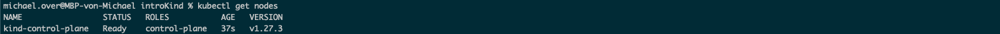

You will see that we have a simple one-node cluster. Now, let's create our first pod by running the following command:

```bash
kubectl run --image nginx:latest --port 80 test-nginx
```


This will create a simple Nginx pod. We can check the running pods in the default namespace:

```bash
kubectl get pods
```

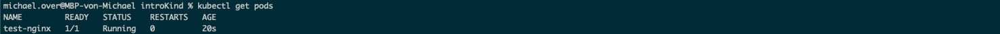

You will see that the pod is running. To access the pod, we can use port forwarding on our local machine:

```bash
kubectl port-forward pods/test-nginx 9090:80
```

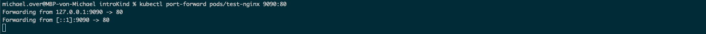

Now, our local port 9090 is bound to port 80 on the pod. In another terminal, we can use curl to check if the pod is responding to our requests:

```bash
curl localhost:9090
```

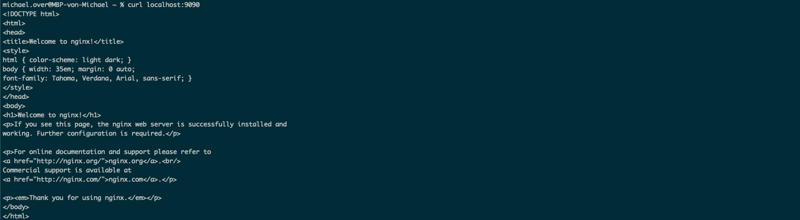

You should see the Welcome page from Nginx. You can also use your browser and navigate to [http://localhost:9090](http://localhost:9090/) to see the page. If you check the terminal where we are running the port forward, you will see the requests that we made. If you want to verify that the pod is serving our requests, you can check the logs:

```bash
kubectl logs test-nginx
```


Now that we have checked the simple Kind cluster, you might think that this is a simple use case. But what if you want to test something more complex? I have something more advanced to show you.

### Big Cluster

To showcase more features and possibilities, let's pretend that we want to deploy an application with 3 replicas and make it reachable via ingress. To be closer to our remote clusters, we need a cluster with more than one node. We will create a cluster with 1 master node and 3 worker nodes.

To create a cluster with more than one node, we need to create a YAML file that holds the configuration for the Kind cluster. Here is an example YAML file:

```yaml
---
kind: Cluster
apiVersion: kind.x-k8s.io/v1alpha4
name: the-big-demo-cluster
```

This YAML file will create a cluster with the name "the-big-demo-cluster". But we want more nodes, so let's add them:

```yaml
---
kind: Cluster
apiVersion: kind.x-k8s.io/v1alpha4
name: the-big-demo-cluster
nodes:
- role: control-plane
- role: worker
- role: worker
- role: worker

```

This cluster will have the nodes that we want. However, we also need a label and a port mapping for the ingress. Additionally, I want to show you how to set the Kubernetes version for each node. Here is an updated version of the YAML file:

```yaml
---
kind: Cluster
apiVersion: kind.x-k8s.io/v1alpha4
name: the-big-demo-cluster
nodes:
  - role: control-plane
    image: kindest/node:v1.27.3
    kubeadmConfigPatches:
      - |
        kind: InitConfiguration
        nodeRegistration:
          kubeletExtraArgs:
            node-labels: "ingress-ready=true"
    extraPortMappings:
      - containerPort: 80
        hostPort: 80
        protocol: TCP
      - containerPort: 443
        hostPort: 443
        protocol: TCP
  - role: worker
    image: kindest/node:v1.27.3
  - role: worker
    image: kindest/node:v1.27.3
  - role: worker
    image: kindest/node:v1.27.3

```

In this YAML file, you can see that you can set the Kubernetes configuration per node, allowing you to test things like different version differences between nodes. To create a cluster with this YAML file, you can use the following command:

```bash
kind create cluster --config the-big-demo-cluster.yaml
```

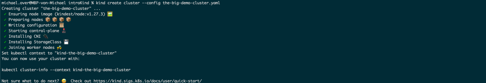

Now we have a cluster with more than one node. Let's check the nodes:

```bash
kubectl get nodes
```

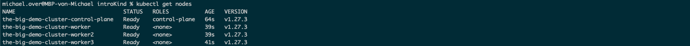

You will see that we have a cluster with multiple nodes. Now, we can install the Ingress Controller. For this example, we will use the Nginx Ingress Controller. We will use a specific manifest that has been patched to work with Kind and uses the label that we set on the control-plane node. Run the following command to install the Ingress Controller:

```bash
kubectl apply -f https://raw.githubusercontent.com/kubernetes/ingress-nginx/main/deploy/static/provider/kind/deploy.yaml
```


After the Ingress Controller is installed, you can check if an Ingress Class is created in the cluster and all pods are running:

```bash
kubectl get pods -A
```

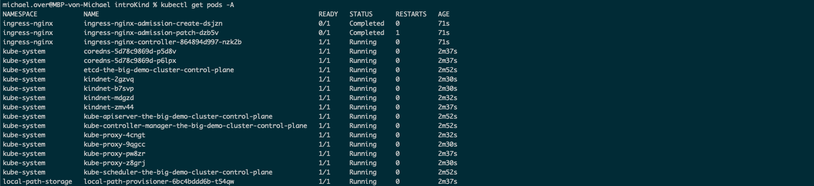

```bash
kubectl get ingressclasses.networking.k8s.io
```

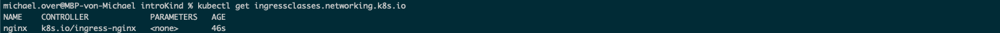

You should see the Ingress Class named "nginx".

Now, let's create a deployment. Here is an example manifest:

```yaml
---
apiVersion: apps/v1
kind: Deployment
metadata:
  labels:
    app: test-deployment
  name: test-deployment
spec:
  replicas: 9
  selector:
    matchLabels:
      app: test-deployment
  template:
    metadata:
      creationTimestamp: null
      labels:
        app: test-deployment
    spec:
      containers:
      - image: nginx:latest
        name: nginx
        ports:
        - containerPort: 80

```

You can create the deployment by applying the manifest:

```bash
kubectl apply -f test-deployment.yaml
```

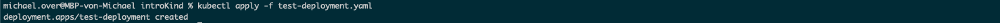

After the deployment is created, you can check the running pods and on which nodes they are running:

```bash
kubectl get pods -o wide
```


Now that we have our deployment running, we need to create a Service and an Ingress to make the deployment accessible. Here are the manifests for the Service and Ingress:

```yaml
---
apiVersion: v1
kind: Service
metadata:
  creationTimestamp: null
  labels:
    app: test-deployment
  name: test-service
spec:
  ports:
  - name: http
    port: 80
    protocol: TCP
    targetPort: 80
  selector:
    app: test-deployment
  type: ClusterIP

```

```yaml
---
apiVersion: networking.k8s.io/v1
kind: Ingress
metadata:
  name: test-ingress
spec:
  rules:
  - http:
      paths:
      - pathType: Prefix
        path: /
        backend:
          service:
            name: test-service
            port:
              number: 80

```

If you take a look at the Ingress manifest, you will notice that we don't have a host set. In this case, we will use "localhost" as the hostname. If you set a host in the Ingress, remember that you also need to set a DNS record or make an entry in your hosts file on your system. Apply these resources to the cluster:

```bash
kubectl apply -f test-service.yaml
kubectl apply -f test-ingress.yaml
```

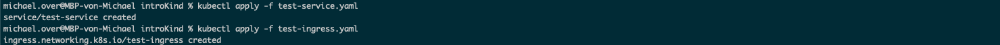

You can check if the Ingress is created in the cluster:

```bash
kubectl get ingress
```

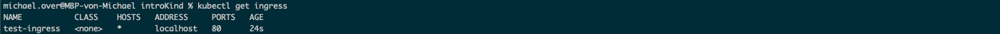

You should see the Ingress named "test-ingress". Now, you can try to access the deployment. You can browse with your browser to [http://localhost](http://localhost/) or use curl. Here is an example using curl:

```bash
curl localhost

```


You should see the Welcome page from Nginx. You can now create more deployments and make them reachable via the Ingress. If you want to make more then one deployment reachable you have to work with subpaths in the ingress or set hosts entries to work with more names.

### And now?

"What now?" is always a good question. But now you know how to get started with Kind. Now it's your turn. If you also like the Kind project, you can start using it and build other cool things that you dreamt about.

Sadly, now I have to say goodbye. I hope you enjoyed reading about Kind!